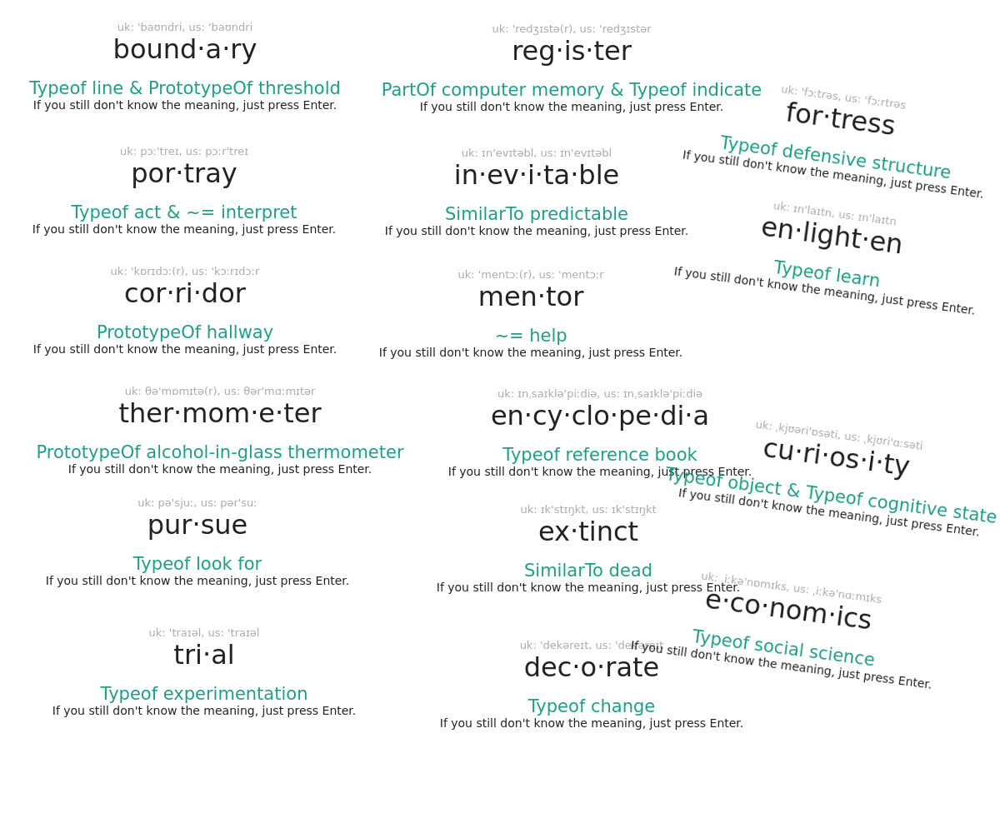

<h1 align="center">Shanbay Desktop</h1>

<code>// Aka. Better Shanbay but that sound problematic.</code>

A new <a href="https://www.shanbay.com/">Shanbay</a> client for PC.

## State

**This program is currently still in development process.** If you know how to run software
from source code, you can `git clone` and run it via:

    npm install
    npm start

If you encounter any bug, please [report it](https://github.com/micromaomao/Better-Shanbay/issues)!
Please describe steps to reproduce, and your environment information ( OS, etc. )

## Features

It will ask you to spell the word first. May help remembering it's spelling.

----

It will ask you to tell a synonym of that word so you don't just press "pass"
without even looking at the word. You may still mark the word as "pass" even if
you can't come up with a synonym.

----

Smarter hint!

----

<del>Pirated</del> Collins Dictionary.

----

Image search engine as word hint!

( 墙内的朋友不用担心，会自动切换到Bing )

----

You can see 10 synonym of the word.

( OK, that's all. If you want more, why not [tell me](https://github.com/micromaomao/Better-Shanbay/issues)? )

## How to contribute?

Just start a [pull request](https://github.com/micromaomao/Better-Shanbay/pulls). There is no coding standard etc. ( yet ).

## What is [Shanbay](https://www.shanbay.com/)?

A Chinese website to help you improve your English skills in 4 ways.

## FAQ

### 为什么是英文界面？

练习英文= =

### Does this support ( 听力 / 炼句 / 阅读 )?

Not yet.

### How do you get the Shanbay API?

By reverse engineering shanbay.com client javascript.

You can [read the document here](doc/shanbay/api-xhr/). **Please don't abuse it!**
