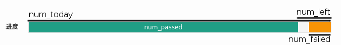

# `//www.shanbay.com/api/v1/bdc/` API document

## Routes
### `/stats`
#### **GET** `/today`

Get the word count for today's task.

**Return**: json

Example:

    {
      "msg": "SUCCESS",
      "status_code": 0,
      "data": {
        "num_progressed": 40,
        "num_reviewed": 0,
        "num_new": 20,
        "num_left": 16,
        "num_passed": 40,
        "num_checkin_days": 46,
        "correctness": 0,
        "num_failed": 0,
        "estimated_minutes": 0,
        "num_mastered": 16,
        "used_minutes": 5,
        "num_today": 56,
        "num_total": 56
      }
    }

Description:

### **GET** `/review`

Get `len` words from today's task. The result may change randomly between calls.
Just study these words.

**Params**:

* `len`: `int`, max number of words to return.
* `update_type`:

**Return**: json

Example:

	{
	  "msg": "SUCCESS",
	  "status_code": 0,
	  "data": {
		"reviews": [
		  {
			"en_definitions": {
			  "n": [
				"an organization of people (or countries) involved in a pact or treaty",
				"the spatial property possessed by an arrangement or position of things in a straight line or in parallel lines",
				"(astronomy) apparent meeting or passing of two or more celestial bodies in the same degree of the zodiac"
			  ]
			},
			"pronunciations": {
			  "uk": "\u0259'la\u026anm\u0259nt",
			  "us": "\u0259'la\u026anm\u0259nt"
			},
			"learning_example_ids": [
			  
			],
			"audio_addresses": {
			  "uk": [
				"https:\/\/words-audio.oss.aliyuncs.com\/uk%2Fa%2Fal%2Falignment.mp3",
				"http:\/\/words-audio.cdn.shanbay.com\/uk\/a\/al\/alignment.mp3"
			  ],
			  "us": [
				"https:\/\/words-audio.oss.aliyuncs.com\/us%2Fa%2Fal%2Falignment.mp3",
				"http:\/\/words-audio.cdn.shanbay.com\/us\/a\/al\/alignment.mp3"
			  ]
			},
			"sys_example_ids": [
			  3319498,
			  228963,
			  228964
			],
			"user_note_ids": [
			  
			],
			"uk_audio": "http:\/\/media.shanbay.com\/audio\/uk\/alignment.mp3",
			"review_status": 2,
			"is_new": false,
			"audio_name": "alignment",
			"cn_definition": {
			  "pos": "",
			  "defn": "n. \u961f\u5217\uff0c\u6210\u76f4\u7ebf\uff1b\u6821\u51c6\uff1b\u7ed3\u76df"
			},
			"shared_note_ids": [
			  79512,
			  33945
			],
			"sense_id": 0,
			"id": 36887833741,
			"retention": 3,
			"definition": "",
			"audio": "http:\/\/media.shanbay.com\/audio\/us\/alignment.mp3",
			"test_choice_ids": [
			  1349,
			  9072,
			  17807,
			  6725
			],
			"learning_note_ids": [
			  
			],
			"level": 0,
			"has_audio": true,
			"userid": 13955365,
			"content": "alignment",
			"pron": "\u0259'la\u026anm\u0259nt",
			"en_definition": {
			  "pos": "n",
			  "defn": "an organization of people (or countries) involved in a pact or treaty; the spatial property possessed by an arrangement or position of things in a straight line or in parallel lines; (astronomy) apparent meeting or passing of two or more celestial bodies in the same degree of the zodiac"
			},
			"user_example_ids": [
			  
			],
			"review_times": 0,
			"content_id": 6725,
			"us_audio": "http:\/\/media.shanbay.com\/audio\/us\/alignment.mp3"
		  }
		],
		"result": {
		  "fetch_status": 0
		}
	  }
	}

Description:

* `review_status`: The learning state of the word. 0 = fresh, 1 = passed (one time), 2 = reviewed (today green), 3 = failed (yellow)
* `retention`: ?
* `content_id`: Word id
* `id`: Review id used with PUT

### **PUT** `/review`

Mark review status. May not work if you are trying to downgrade result to 1 (0 works.)

**Params**: JSON

Example:

    {"ids":"36158099308","results":"0","seconds":"3"}

Description:

* `ids`: Array of `id` from GET `/review`
* `results`: Array of result map to id. Result: 0 = forget, 1 = passed, 2 = green

### **GET** `/example`

Get example sentence.

**Params**:

* `ids`: `sys_example_ids` + `learning_example_ids` ( own sentence ) from `/review`

**or**

* `vocabulary_id`: one word id ( `content_id` from `/review` ) ( return shared sentence )

**Return**: json

Example:

    {
      "msg": "SUCCESS",
      "status_code": 0,
      "data": [
        {
          "username": "Shanbay",
          "likes": 255,
          "last": ".",
          "userid": 0,
          "mid": "myth",
          "audio_name": "",
          "annotation": "the realm of <vocab>myth<\/vocab>.",
          "audio_addresses": {
            
          },
          "version": 53,
          "unlikes": 34,
          "user": {
            "username": "Shanbay",
            "nickname": "Shanbay",
            "id": 1,
            "avatar": "https:\/\/static.baydn.com\/avatar\/media_store\/0ef69ded3383a1cffcdeb71280ddbc7e.png?imageView\/1\/w\/128\/h\/128\/"
          },
          "word": "myth",
          "translation": "\u795e\u8bdd\u738b\u56fd",
          "nickname": "Shanbay",
          "id": 244945,
          "first": "the realm of "
        },
		{
		  "username": "zzw0826",
		  "likes": 5,
		  "last": ".",
		  "userid": 444093,
		  "mid": "myth",
		  "audio_name": "",
		  "annotation": "The story is a pure <vocab>myth<\/vocab>.",
		  "audio_addresses": {
			
		  },
		  "version": 0,
		  "unlikes": 0,
		  "user": {
			"username": "zzw0826",
			"nickname": "zzw0826",
			"id": 444093,
			"avatar": "https:\/\/static.baydn.com\/static\/img\/icon_head.png"
		  },
		  "word": "myth",
		  "translation": "\u8fd9\u6545\u4e8b\u7eaf\u5c5e\u865a\u6784\u3002",
		  "nickname": "zzw0826",
		  "id": 1506688,
		  "first": "The story is a pure "
		}
      ]
    }

Description:

* Sentence: `first` + `mid` + `last`

### **POST** `/example`

**Params**: json

Example:

    {"original":"Hello world!","translation":"世界，您好！","vocabulary":6639}

Description:

* `original`: the sentence
* `vocabulary`: word id

### **GET** `/note`

Get shared notes

**Params**:

* `ids`: `learning_note_ids` from `/review` ( Return own note )

**or**

* `vocabulary_id`: Word id ( `content_id` from `/review` )

**Return**: json

Example:

    {
      "msg": "SUCCESS",
      "status_code": 0,
      "data": [
        {
          "username": "smaxii",
          "image": "",
          "userid": 58256,
          "content": "\u53ef\u6570\u540d\u8bcd\n------\n\nmythology \u795e\u8bdd\u7684\u603b\u79f0\uff08\u4e0d\u53ef\u6570\uff09",
          "unlikes": 0,
          "likes": 6,
          "nickname": "smaxii",
          "id": 1974913,
          "user": {
            "username": "smaxii",
            "nickname": "smaxii",
            "id": 58256,
            "avatar": "https:\/\/static.baydn.com\/avatar\/media_store\/0b4bb60bff39d14ee5360a7589bd1b2e.jpg?imageView\/1\/w\/128\/h\/128\/"
          }
        },
        {
          "username": "puffin520",
          "image": "",
          "userid": 3518335,
          "content": "mythology n. \u795e\u8bdd\uff1b\u795e\u8bdd\u5b66\uff1b\u795e\u8bdd\u96c6\r\nmystery\u795e\u79d8 \r\ngreek myth \u5e0c\u814a\u795e\u8bdd ",
          "unlikes": 0,
          "likes": 2,
          "nickname": "puffin520",
          "id": 4781698,
          "user": {
            "username": "puffin520",
            "nickname": "puffin520",
            "id": 3518335,
            "avatar": "https:\/\/static.baydn.com\/static\/img\/icon_head.png"
          }
        }
      ]
    }

### **POST** `/note`

Create note.

**Params**: json

Example:

    {"note":"test2","vocabulary":6078}

Description:

* `note`: the note
* `vocabulary`: word id
